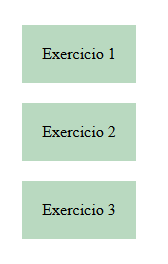
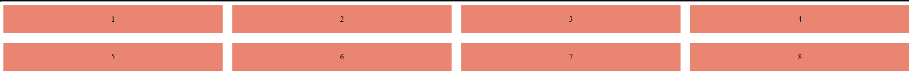

# 🧩 Exercício - CSS Grid

Este projeto foi desenvolvido durante o curso de **Front-End no SENAI Suíço-Brasileiro**.  
O objetivo é praticar os conceitos de **CSS Grid Layout**, explorando **divisões de colunas e tamanhos**.

---
## 📁 Exercicio-Grid

    ┣ 📄 index.html     → Página inicial que direciona para os três exercícios
    ┣ 📁 pages
    ┃  ┗ ┣ 📄 exercicio.html → Divisões básicas
    ┃    ┣ 📄 exercicio1.html → Diferentes tamanhos de colunas
    ┃    ┗ 📄 exercicio2.html → Combinações e ajustes de layout
    ┣ 📁 style
    ┃  ┗ ┣ 📄 exec.css → Estiliza o exercicio.html
    ┃    ┣ 📄 exec1.css → Estiliza o exercicio1.html
    ┃    ┣ 📄 exec2.css → Estiliza o exercicio2.html
    ┃    ┗ 📄 style.css → Estiliza o index.html para direcionar aos exercícios
     
---

## 🔧 Tecnologias Utilizadas
- **HTML5**
- **CSS3 (Grid Layout)**

---

## 📍 Clique no Link para visualizar esse projeto

### [Exercício Grid](https://grid-beta-one.vercel.app)

## 📸 Demonstração:

### Index

### Exercício 1

### Exercício 2

### Exercício 3

## 📚 Aprendizados

Criação de layouts usando grid-template-columns

Definição de frações (fr) e tamanhos fixos (px, %)

Controle de espaçamento entre colunas (gap)

