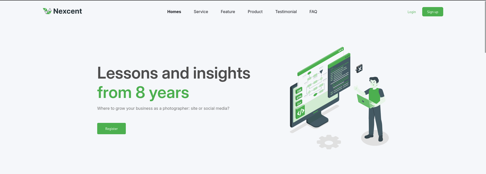

# 🧩 Landing Page - NextCent

Este projeto foi desenvolvido durante o curso de **Front-End no SENAI Suíço-Brasileiro**.  
O objetivo é praticar os conceitos de **CSS**.

---

## 📸 Demonstração:

## 📍 [Clique aqui para visualizar esse projeto](https://nextcent-psi.vercel.app/)

## 🔧 Tecnologias Utilizadas

- **HTML5**
- **CSS3**

---

## 📁 Quick Food

    ┣ 📄 index.html
    ┣ 📁 src
    ┃  ┣  📁 style
    ┃  ┃   ┣  📄 style.css
    ┃  ┃   ┗  📄 global.css
    ┃  ┣  📁 assets
    ┃  ┃   ┃ 📁 img
    ┃  ┃   ┃  ┗ (All images in project)

---

## 📚 Aprendizados

Criação de layouts usando Display Flex

Controle de espaçamento (gap)
